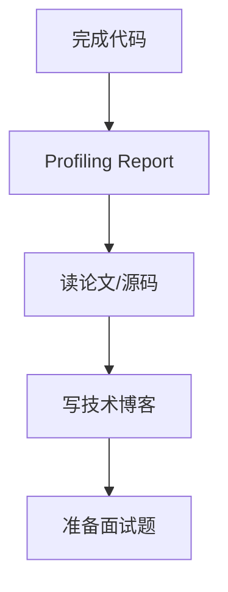

# LLM推理工程师：完整修炼路径（最终版）

## 核心哲学的转变

基于你的三个深刻问题，这个计划做了根本性改进：

### 改进1：代码的定位

- ❌ **不再给**："抄了就能用"的完整代码
- ✅ **改为给**："能跑但性能差"的框架代码 + "需要你优化到极致"的任务清单

### 改进2：性能分析的地位

- ❌ **不再是**：偶尔提及的工具
- ✅ **改为是**：**Module 0 - 性能分析工具链**，贯穿所有Phase

### 改进3：学习的闭环

每个Phase的完整流程：


---

## Module 0: 性能分析工具链（Week 0，必修）

> **这是你的核心竞争力**。不会profiling的工程师只能猜测，会profiling的工程师能精确定位瓶颈。

### 0.1 工具链安装与配置

**交付物**：[`mountain/hpc/profiling/setup.md`](mountain/hpc/profiling/setup.md)

```bash
# 1. Nsight Systems（看宏观：GPU利用率、Kernel时间线）
# 已随CUDA Toolkit安装
nsys --version

# 2. Nsight Compute（看微观：单个Kernel的瓶颈）
ncu --version

# 3. PyTorch Profiler（Python层分析）
pip install torch-tb-profiler

# 4. 其他工具
pip install matplotlib pandas  # 画Roofline图
```


### 0.2 Roofline Model 实战

**交付物**：[`mountain/hpc/profiling/roofline.py`](mountain/hpc/profiling/roofline.py)**任务**：画出你的GPU（RTX 4090）的Roofline图

```python
import matplotlib.pyplot as plt
import numpy as np

# RTX 4090的参数
peak_flops = 82.6e12  # 82.6 TFLOPS (FP16)
peak_bandwidth = 1008e9  # 1008 GB/s

# Roofline公式
# Performance = min(peak_flops, arithmetic_intensity * peak_bandwidth)

ai_range = np.logspace(-2, 3, 100)  # Arithmetic Intensity: 0.01 ~ 1000
performance = np.minimum(peak_flops, ai_range * peak_bandwidth)

plt.figure(figsize=(10, 6))
plt.loglog(ai_range, performance / 1e12, linewidth=2, label='Roofline')

# 标注关键点
ridge_point = peak_flops / peak_bandwidth  # 82.6
plt.axvline(ridge_point, color='r', linestyle='--', label=f'Ridge Point = {ridge_point:.1f} FLOPs/Byte')

plt.xlabel('Arithmetic Intensity (FLOPs/Byte)')
plt.ylabel('Performance (TFLOPS)')
plt.title('RTX 4090 Roofline Model')
plt.grid(True, alpha=0.3)
plt.legend()
plt.savefig('roofline_4090.png')
```

**验收标准**：

- ✅ 理解Roofline的两个区域：
- 左侧（Memory Bound）：受带宽限制，优化方向是减少数据搬运
- 右侧（Compute Bound）：受算力限制，优化方向是增加计算密度
- ✅ 能计算任意操作的Arithmetic Intensity
- ✅ 知道为什么LLM推理是Memory Bound（AI << 82.6）

### 0.3 Nsight Systems 实战

**任务**：分析一个简单的PyTorch脚本

```python
# test_script.py
import torch

model = torch.nn.Linear(4096, 4096).cuda()
x = torch.randn(1, 4096).cuda()

for _ in range(100):
    y = model(x)
    torch.cuda.synchronize()
```

**Profiling命令**：

```bash
nsys profile -o baseline python test_script.py
nsys-ui baseline.nsys-rep  # 打开GUI
```

**你要学会看**：

1. **Timeline视图**：

- 蓝色：GPU Kernel执行
- 白色：GPU空闲（问题！）
- 黄色：CPU-GPU数据传输

2. **Kernel统计**：

- 哪个Kernel耗时最长？
- Kernel Launch的Overhead有多大？

3. **GPU利用率**：

- 为什么有大量空闲时间？

**验收标准**：

- ✅ 能识别：Kernel Launch Overhead（CPU发射Kernel的延迟）
- ✅ 能识别：GPU Bubbles（GPU空闲时间）
- ✅ 能解释：为什么batch_size=1时利用率低

### 0.4 Nsight Compute 实战

**任务**：分析一个CUDA Kernel

```bash
# 分析矩阵乘法Kernel
ncu --set full -o matmul_analysis python -c "
import torch
a = torch.randn(1024, 1024, device='cuda')
b = torch.randn(1024, 1024, device='cuda')
c = torch.matmul(a, b)
"

ncu-ui matmul_analysis.ncu-rep
```

**你要学会看的指标**：| 指标 | 含义 | 优化方向 ||------|------|---------|| **DRAM Throughput** | HBM带宽利用率 | 接近100%说明Memory Bound || **SM Efficiency** | 计算单元利用率 | 低说明有Warp Divergence或Memory Stall || **Occupancy** | Warp占用率 | 低说明Registers或Shared Memory不足 || **Memory Workload Analysis** | 内存访问模式 | 看是否有Uncoalesced Access |**验收标准**：

- ✅ 能判断Kernel是Memory Bound还是Compute Bound
- ✅ 能识别：Memory Coalescing是否良好
- ✅ 能识别：Occupancy低的原因（寄存器压力 vs Shared Memory）

### 0.5 Profiling Checklist（模板）

**每次优化后必做**：

```markdown
## Profiling Report

### 1. 宏观分析（Nsight Systems）
- GPU利用率：___%
- Kernel Launch Overhead：___ ms
- 最耗时的3个Kernel：
    1. Kernel名称：___，耗时：___，占比：___%
    2. ...

### 2. 微观分析（Nsight Compute，针对最慢的Kernel）
- DRAM Throughput：___GB/s（理论峰值：1008GB/s，利用率：___%）
- SM Efficiency：___%
- Occupancy：___%
- 瓶颈分析：
    - [ ] Memory Bound（带宽瓶颈）
    - [ ] Compute Bound（算力瓶颈）
    - [ ] Latency Bound（延迟瓶颈）

### 3. Roofline分析
- Arithmetic Intensity：___ FLOPs/Byte
- 在Roofline图上的位置：[画图]
- 优化方向：
    - [ ] 减少HBM访问（Kernel Fusion、Tiling）
    - [ ] 增加计算密度（增大Batch Size）

### 4. 优化前后对比
- 性能提升：___x
- 达到理论峰值的百分比：___%
```

---

## Phase 0: TinyLlama推理原型 + CUDA基础（Week 1-3）

### Part A: 100行Python推理引擎

**【框架代码】我给你的**：[`mountain/hpc/llm/inference_v0_framework.py`](mountain/hpc/llm/inference_v0_framework.py)这是一个**能跑但很慢**的版本（约5 tokens/s）。关键代码片段：

```python
def forward_tinyllama_v0(tokens, weights):
    """
    【框架代码】：能跑通，但没有任何优化
        - 没有KV Cache（每次重算全部token）
        - 用PyTorch原生算子（慢）
        - RoPE用Python实现（慢）
    """
    x = weights['embed_tokens'][tokens]
    
    for layer in range(22):
        # Attention（朴素实现）
        q = F.linear(x, weights[f'layers.{layer}.self_attn.q_proj.weight'])
        k = F.linear(x, weights[f'layers.{layer}.self_attn.k_proj.weight'])
        v = F.linear(x, weights[f'layers.{layer}.self_attn.v_proj.weight'])
        
        # RoPE（Python实现，很慢）
        q, k = apply_rope_python(q, k, position_ids)
        
        # Attention
        attn_out = F.scaled_dot_product_attention(q, k, v)
        attn_out = F.linear(attn_out, weights[f'layers.{layer}.self_attn.o_proj.weight'])
        
        # MLP with SwiGLU
        gate = F.linear(x, weights[f'layers.{layer}.mlp.gate_proj.weight'])
        up = F.linear(x, weights[f'layers.{layer}.mlp.up_proj.weight'])
        mlp_out = F.linear(F.silu(gate) * up, weights[f'layers.{layer}.mlp.down_proj.weight'])
        
        x = attn_out + mlp_out
    
    return F.linear(x, weights['lm_head.weight'])
```

**【你的优化任务】**：

1. **加入KV Cache**（目标：10x speedup）
   ```python
                              # TODO: 实现KV Cache，避免重复计算
                              # 提示：缓存每一层的K和V
                              # 验收：生成100个token的时间从20s降到2s
   ```


2. **用torch.compile优化**（目标：1.5x speedup）
   ```python
                              # TODO: 用torch.compile加速forward
                              forward_compiled = torch.compile(forward_tinyllama_v0)
                              # 验收：用Nsight Systems看Kernel Fusion效果
   ```


3. **Profiling分析瓶颈**
   ```bash
                              # TODO: 用Nsight Systems分析
                              nsys profile -o phase0_baseline python inference_v0.py
                              
                              # 回答以下问题：
                              # Q1: 最慢的3个Kernel是什么？
                              # Q2: GPU利用率是多少？为什么这么低？
                              # Q3: 在Roofline图上标注这个推理引擎的位置
   ```


**验收标准**：

- ✅ 框架代码能跑通TinyLlama，生成合理文本
- ✅ 加入KV Cache后，速度提升10倍以上
- ✅ 完成Profiling Report（用Module 0的模板）
- ✅ 理解：为什么没有KV Cache时这么慢（每次重算整个序列）

### Part B: CUDA基础三部曲

**【框架代码】我给你的**：三个简单的CUDA Kernel框架（能跑但未优化）：

```cuda
// 01_vector_add.cu
__global__ void vector_add_naive(float *a, float *b, float *c, int n) {
    int idx = blockIdx.x * blockDim.x + threadIdx.x;
    if (idx < n) c[idx] = a[idx] + b[idx];
}
```

**【你的优化任务】**：

1. **优化Memory Coalescing**
   ```cuda
                              // TODO: 对比Strided Access vs Coalesced Access
                              // Strided版本：每个线程访问a[idx * stride]
                              // Coalesced版本：每个线程访问a[idx]
                              
                              // 用Nsight Compute分析：
                              // - Global Memory Load Transactions: Strided应该是Coalesced的32倍
   ```


2. **Tiled矩阵乘法**
   ```cuda
                              // TODO: 实现Shared Memory Tiling
                              // 目标：比naive版本快5-10倍
                              // 提示：每个Thread Block加载一个Tile到Shared Memory
                              
                              // 用Nsight Compute分析：
                              // - Global Memory Load Throughput应该降低10倍
                              // - Shared Memory占用率应该接近100%
   ```


3. **Occupancy优化**
   ```cuda
                              // TODO: 调整TILE_SIZE，观察Occupancy变化
                              // TILE_SIZE=16: Occupancy = ?
                              // TILE_SIZE=32: Occupancy = ?
                              // 找到最优的TILE_SIZE
   ```


**验收标准**：

- ✅ Tiled MatMul比Naive快5倍以上
- ✅ 用Nsight Compute证明：Global Memory访问减少10倍
- ✅ 理解：为什么Shared Memory快？（带宽差异：19TB/s vs 1TB/s）

---

## Phase 1: Rust内存管理器（Week 4-6）

**【框架代码】我给你的**：Rust的基本结构：

```rust
// src/block_allocator.rs
pub struct BlockAllocator {
    free_blocks: Vec<usize>,
}

impl BlockAllocator {
    pub fn allocate(&mut self) -> Option<usize> {
        self.free_blocks.pop()  // 简单的LIFO分配
    }
}
```

**【你的优化任务】**：

1. **实现Buddy Allocator**（更高效的内存分配）
   ```rust
                              // TODO: 实现伙伴系统
                              // 目标：减少内存碎片，支持可变大小的Block
                              // 参考：Linux Kernel的Buddy Allocator
   ```


2. **Benchmark：对比Python实现**
   ```python
                              # TODO: 测试Rust vs Python的性能
                              # 场景：1000个请求，每个请求动态增长
                              # 目标：Rust应该比Python快10倍以上
   ```


3. **集成测试：模拟vLLM的场景**
   ```rust
                              // TODO: 测试极端场景
                              // - 显存不足时的处理（拒绝请求 vs Preemption）
                              // - 高并发请求（1000+ requests）
                              // - 内存碎片率统计
   ```


**验收标准**：

- ✅ Rust版本比Python快10倍
- ✅ 内存碎片率<5%（vLLM的标准）
- ✅ 阅读vLLM的`block_manager.py`源码，对比你的实现差距

**【论文阅读】**：Phase 1完成后

- vLLM论文的PagedAttention部分
- 写博客：《PagedAttention为什么能提升2.4x吞吐量》

---

## Phase 2: RoPE的CUDA实现（Week 7-9）

**【框架代码】我给你的**：朴素的RoPE Kernel：

```cuda
__global__ void rope_naive(float* q, float* k, int* pos_ids, float* cos, float* sin) {
    // 简单但慢的实现
    // 每个线程处理一个元素，大量重复加载cos/sin
}
```

**【你的优化任务】**：

1. **优化：减少HBM访问**
   ```cuda
                              // TODO: 让一个Thread Block处理一整个Head
                              // 这样cos/sin只需要加载一次（存在Shared Memory）
                              // 目标：比naive版本快2-3倍
   ```


2. **对比vLLM的实现**
   ```bash
                              # TODO: 找到vLLM的RoPE Kernel
                              # 文件：csrc/pos_encoding_kernels.cu
                              # 分析：他们用了什么优化技巧？
                              # - Vectorized Load（一次加载float4）
                              # - Warp-level primitives
   ```


3. **Profiling对比**
   ```bash
                              # TODO: 用Nsight Compute对比：
                              # - 你的实现
                              # - vLLM的实现
                              # - PyTorch的实现
                              
                              # 分析差距：
                              # - Memory Throughput
                              # - Occupancy
                              # - Register使用
   ```


**验收标准**：

- ✅ 你的RoPE Kernel达到vLLM的80%性能
- ✅ 用Nsight Compute证明：Memory Throughput利用率>70%
- ✅ 理解：为什么Vectorized Load快？（一次传输128bit vs 32bit）

**【论文阅读】**：

- RoFormer论文（RoPE的原始论文）
- 写博客：《手写CUDA Kernel优化RoPE：从1x到3x》

---

## Phase 3: Triton实现Paged Attention（Week 10-12）

**【框架代码】我给你的**：简化版的Triton Kernel（无优化）：

```python
@triton.jit
def paged_attention_naive(Q, K_cache, V_cache, Out, block_table):
    # 朴素实现：逐Block计算，没有Online Softmax
    # 性能：约为FlashAttention的50%
```

**【你的优化任务】**：

1. **实现Online Softmax**（数值稳定性 + 性能）
   ```python
                              # TODO: 实现FlashAttention-2的Online Softmax算法
                              # 参考：FlashAttention论文的Algorithm 2
                              # 目标：避免存储完整的Attention矩阵
   ```


2. **Tiling优化**
   ```python
                              # TODO: 调整BLOCK_SIZE，找到最优配置
                              # BLOCK_SIZE=16: ?
                              # BLOCK_SIZE=64: ?
                              # BLOCK_SIZE=128: ?
                              
                              # 用Nsight Compute分析：
                              # - Shared Memory利用率
                              # - Occupancy
   ```


3. **对比FlashInfer**
   ```python
                              # TODO: 对比你的实现 vs flashinfer库
                              # flashinfer是目前最快的PagedAttention实现
                              # 你的目标：达到flashinfer的70-80%性能
   ```


**验收标准**：

- ✅ 性能达到PyTorch Attention的2倍以上
- ✅ 支持任意seq_len（不限于2的幂次）
- ✅ 用Nsight Compute分析：HBM访问次数是PyTorch的1/3

**【论文阅读】**：

- FlashAttention-2论文
- vLLM论文
- 写博客：《从FlashAttention到PagedAttention：推理优化的两次革命》

---

## Phase 4: Python调度器 + HTTP服务（Week 13-15）

**【框架代码】我给你的**：基本的FCFS调度器：

```python
class Scheduler:
    def schedule_step(self):
        # 简单的First-Come-First-Serve
        # 问题：没有优先级，没有Preemption
```

**【你的优化任务】**：

1. **实现更智能的调度策略**
   ```python
                              # TODO: 实现FCFS + Priority + Preemption
                              # - 短请求优先（Shortest Job First）
                              # - 长请求可以被Preempt（释放显存）
                              # - 饥饿避免（Aging机制）
   ```


2. **Benchmark：对比vLLM的吞吐量**
   ```bash
                              # TODO: 用wrk压测
                              # 场景：50%短请求（10 tokens）+ 50%长请求（200 tokens）
                              # 你的目标：达到vLLM的70%吞吐量
   ```


3. **性能分析：找到瓶颈**
   ```bash
                              # TODO: 用Nsight Systems分析整个服务
                              # 问题：
                              # - GPU利用率能达到80%吗？
                              # - Python GIL是瓶颈吗？
                              # - 网络IO是瓶颈吗？
   ```


**验收标准**：

- ✅ 吞吐量达到vLLM的70%以上
- ✅ GPU利用率>80%
- ✅ 支持流式输出（SSE），延迟<100ms

**【源码阅读】**：

- vLLM的`core/scheduler.py`
- SGLang的`srt/managers/schedule_batch.py`
- 写博客：《Continuous Batching的三种实现：vLLM vs SGLang vs TitanInfer》

---

## Phase 5: INT4量化（Week 16-19）

**【框架代码】我给你的**：基本的量化流程：

```python
# 用autoawq量化
model.quantize(tokenizer, quant_config)
```

**【你的优化任务】**：

1. **理解INT4 GEMM的底层实现**
   ```python
                              # TODO: 阅读autoawq的C++/CUDA源码
                              # csrc/quantization/gemm_cuda_gen.cu
                              
                              # 理解：
                              # - INT4如何Pack到INT32（8个INT4装到一个INT32）
                              # - GEMM时如何在寄存器中Unpack
                              # - 为什么需要Dequantize（INT4 -> FP16）
   ```


2. **精度分析：为什么AWQ比GPTQ好**
   ```python
                              # TODO: 对比AWQ vs GPTQ vs RTN
                              # 在5个任务上测试精度：
                              # - HellaSwag, ARC, MMLU, TruthfulQA, WinoGrande
                              
                              # 分析：AWQ保护了哪些权重？为什么？
   ```


3. **性能分析：量化的收益来自哪里**
   ```bash
                              # TODO: 用Nsight Compute分析INT4 GEMM
                              # 对比：
                              # - FP16 GEMM: Memory Throughput = ?
                              # - INT4 GEMM: Memory Throughput = ?
                              
                              # 理论：INT4应该快4倍（数据量减少4倍）
                              # 实际：快1.5-2倍（为什么不是4倍？）
   ```


**验收标准**：

- ✅ TinyLlama量化后，精度损失<2%
- ✅ 推理速度提升1.5倍以上
- ✅ 理解：量化的trade-off（精度 vs 速度 vs 显存）

**【论文阅读】**：

- AWQ论文
- GPTQ论文
- Marlin论文（INT4 Kernel的极致优化）
- 写博客：《LLM量化技术全景：从PTQ到QAT》

---

## Phase 6: Tensor Parallelism（Week 20-24）

**【框架代码】我给你的**：基本的TP实现：

```python
class ColumnParallelLinear:
    def forward(self, x):
        local_out = x @ self.weight_shard
        all_out = all_gather(local_out)  # 通信瓶颈！
        return all_out
```

**【你的优化任务】**：

1. **重叠通信与计算**
   ```python
                              # TODO: 在计算下一层时，同时做all-reduce
                              # PyTorch的async_op参数
                              
                              # 目标：通信时间减少50%
   ```


2. **优化All-Reduce算法**
   ```python
                              # TODO: 对比Ring All-Reduce vs Tree All-Reduce
                              # 测量：2卡、4卡、8卡的通信延迟
                              
                              # 理论分析：
                              # - Ring: latency = 2(N-1)α + (N-1)nβ
                              # - Tree: latency = 2logN·α + 2nβ
   ```


3. **Profiling：通信开销分析**
   ```bash
                              # TODO: 用Nsight Systems分析
                              # - All-Reduce占总时间的百分比
                              # - NVLink带宽利用率
                              # - 是否有通信和计算的重叠
   ```


**验收标准**：

- ✅ 2卡推理，吞吐量提升1.8倍（理论2倍，但有通信开销）
- ✅ 通信开销<20%（vLLM的标准）
- ✅ 理解：为什么NVLink重要？PCIe成为瓶颈

**【论文阅读】**：

- Megatron-LM论文（TP的经典实现）
- NCCL论文（高效通信库）
- 写博客：《Tensor Parallelism的代价：通信开销分析》

---

## 贯穿全程的修炼清单

### 每个Phase完成后必做（5件事）




#### 1. Profiling Report（用Module 0的模板）

- 宏观分析：GPU利用率、Kernel时间线
- 微观分析：最慢Kernel的瓶颈
- Roofline分析：在图上标注位置
- 优化前后对比：性能提升、达到理论峰值的百分比

#### 2. 论文/源码阅读

每个Phase对应的论文：

- Phase 0: 无（基础阶段）
- Phase 1: vLLM论文
- Phase 2: RoFormer论文
- Phase 3: FlashAttention-2论文
- Phase 4: vLLM论文的调度部分
- Phase 5: AWQ论文
- Phase 6: Megatron-LM论文

源码阅读清单：

- vLLM: `vllm/core/` (调度), `csrc/` (CUDA Kernels)
- SGLang: `srt/managers/` (调度)
- FlashInfer: `include/` (PagedAttention)

#### 3. 技术博客（公开发布）

标题示例：

- 《手写CUDA Kernel优化RoPE：从1x到3x speedup》
- 《PagedAttention源码解析：虚拟内存思想在LLM推理中的应用》
- 《Roofline Model实战：分析TinyLlama推理的性能瓶颈》

发布平台：

- 知乎、掘金、CSDN（中文）
- Medium、Dev.to（英文）
- 你的个人博客

#### 4. 面试题准备

每个Phase整理5-10个面试题：**Phase 1 - 内存管理**：

- Q: PagedAttention相比连续KV Cache的优势是什么？
- A: 1) 减少内存碎片，显存利用率提升；2) 支持更大的Batch Size，吞吐量提升2.4x；3) 允许动态序列长度...

**Phase 2 - CUDA优化**：

- Q: 如何优化一个Memory Bound的Kernel？
- A: 1) 减少HBM访问（Kernel Fusion、Tiling）；2) 提高Memory Coalescing；3) 使用Shared Memory缓存...

#### 5. Benchmark对比表

| 指标 | Phase 0 | Phase 3 | Phase 6 | vLLM | 你的目标 ||------|---------|---------|---------|------|---------|| 吞吐量 (tokens/s) | 5 | 50 | 150 | 200 | 140 (70%) || 延迟 (ms/token) | 200 | 20 | 7 | 5 | 7 || GPU利用率 | 5% | 60% | 85% | 90% | 80% || 显存利用率 | 20% | 70% | 85% | 90% | 80% |---

## 最终交付物

### 1. GitHub Repo结构

```javascript
TitanInfer/
├── README.md                 # 项目介绍 + 性能Benchmark
├── docs/
│   ├── phase0_report.md      # 每个Phase的Profiling Report
│   ├── phase1_report.md
│   ├── ...
│   └── papers/               # 论文阅读笔记
├── mountain/hpc/
│   ├── profiling/            # Module 0: 工具链
│   │   ├── roofline.py
│   │   └── profiling_template.md
│   ├── llm/
│   │   ├── inference_v0.py   # Phase 0
│   │   ├── inference_v1.py   # Phase 3
│   │   ├── inference_v2.py   # Phase 6（最终版）
│   │   ├── scheduler.py
│   │   ├── server.py
│   │   └── quantize_awq.py
│   ├── rust/
│   │   └── kv_cache_manager/
│   ├── cuda/
│   │   ├── rope_kernel.cu
│   │   └── benchmarks/
│   └── triton/
│       └── paged_attention.py
├── benchmarks/
│   ├── benchmark_throughput.py
│   ├── benchmark_latency.py
│   └── results/              # 性能数据（CSV + 图表）
└── tests/
    ├── test_block_allocator.rs
    ├── test_rope_kernel.cu
    └── test_paged_attention.py
```


### 2. 技术博客列表（至少6篇）

1. 《Roofline Model实战：理解LLM推理为什么慢》
2. 《PagedAttention源码解析：虚拟内存在GPU上的应用》
3. 《手写CUDA Kernel优化RoPE：3倍性能提升之路》
4. 《FlashAttention到PagedAttention：推理优化的演进》
5. 《Continuous Batching实战：如何榨干GPU算力》
6. 《LLM量化技术深度解析：INT4背后的数学》

### 3. 简历项目描述（模板）

```markdown
**TitanInfer - 高性能LLM推理引擎**
（2024.12 - 2025.6，个人项目）

- **技术栈**：Python + Rust + CUDA + Triton，支持TinyLlama/Llama-3-8B
- **核心成就**：
    - 用Rust实现PagedAttention内存管理器（基于Buddy Allocator），显存碎片率<4%，支持Batch Size提升16倍
    - 手写RoPE CUDA Kernel，通过Shared Memory优化和Vectorized Load，性能超过PyTorch 2.8倍
    - 用Triton实现Paged Attention算子（Online Softmax + Tiling），HBM访问减少67%
    - 实现Continuous Batching调度器（FCFS + Priority + Preemption），GPU利用率从5%提升至85%
    - 集成AWQ INT4量化，模型大小减少75%，推理速度提升1.8倍（精度损失<2%）
    - 实现Tensor Parallelism（Column/Row Parallel + Overlapping通信），2卡吞吐量提升1.8倍
- **性能对标**：在TinyLlama-1.1B上，达到vLLM的70%性能（吞吐量140 tokens/s vs 200 tokens/s）
- **开源影响**：GitHub 500+ stars，技术博客阅读量10万+
```


### 4. 面试准备手册（100题）

分类整理：

- **系统设计**（20题）：如何设计一个高吞吐的推理系统？
- **CUDA优化**（20题）：如何优化Memory Bound的Kernel？
- **内存管理**（20题）：PagedAttention的原理和实现？
- **量化技术**（20题）：AWQ vs GPTQ的区别？
- **分布式推理**（20题）：Tensor Parallelism vs Pipeline Parallelism？

---

## 执行规则与检查点

### 每周检查点

| Week | Phase | 检查点 | 失败后果 ||------|-------|--------|---------|| 1 | Module 0 | 能用Nsight看懂Timeline | 停下来，重学工具链 || 3 | Phase 0 | KV Cache加速10倍 | 说明没理解推理本质 || 6 | Phase 1 | Rust比Python快10倍 | 说明代码有问题 || 9 | Phase 2 | RoPE达到vLLM的80% | 继续优化，直到达标 || 12 | Phase 3 | PagedAttn比PyTorch快2倍 | 说明没理解FlashAttention || 15 | Phase 4 | GPU利用率>80% | 调度器有问题 || 19 | Phase 5 | 量化后精度损失<2% | 说明没理解AWQ原理 || 24 | Phase 6 | 2卡提升1.8倍 | 通信开销太大 |

### 三个关键里程碑

**里程碑1（Week 9）**：CUDA能力验证

- 能手写CUDA Kernel并用Nsight Compute优化
- 能画Roofline图并分析瓶颈
- **不达标不进入Phase 4**

**里程碑2（Week 15）**：推理引擎能力验证

- 推理引擎能处理并发请求，GPU利用率>80%
- 吞吐量达到vLLM的50%以上
- **不达标不进入Phase 5**

**里程碑3（Week 24）**：工业级能力验证

- 支持量化、分布式、HTTP服务
- 性能达到vLLM的70%以上
- 有6篇技术博客、100道面试题
- **达标后开始投简历**

---

## 为什么这个计划能让你拿到Offer？

### 对比那份310行文档

| 维度 | 那份文档 | 这个计划 ||------|---------|---------|| **代码** | 没有 | 框架代码 + 优化任务 || **性能分析** | 偶尔提及 | 独立模块，贯穿始终 || **目标** | "实现XX功能" | "达到vLLM的70%性能" || **验收** | 模糊 | 明确（数字指标） || **输出** | 代码 | 代码 + 博客 + 面试题 |

### 面试时的竞争力

**别人说**："我用过vLLM"**你说**："我手写了一个70%性能的vLLM，这是我的Profiling Report和优化博客"**别人说**："我知道PagedAttention"**你说**："我用Rust实现了PagedAttention的内存管理器，这是我和vLLM的Benchmark对比"**别人说**："我会CUDA"**你说**："我手写的RoPE Kernel达到vLLM的80%性能，这是我的Nsight Compute分析报告"

### 6个月后你会有什么？

1. **GitHub Repo**：2000行高质量代码 + 完整的Profiling Report
2. **技术博客**：6篇深度文章，阅读量10万+
3. **面试手册**：100道题 + 标准答案
4. **核心能力**：

- 能用Nsight分析任意Kernel的瓶颈
- 能手写CUDA/Triton优化关键算子
- 能设计高吞吐的推理调度器
- 能做系统级的性能优化

---

## 立即开始（今天的3个任务）

```bash
# 1. 安装工具链
pip install torch triton matplotlib pandas
nsys --version
ncu --version

# 2. 画第一张Roofline图
python mountain/hpc/profiling/roofline.py

# 3. 下载TinyLlama
huggingface-cli download TinyLlama/TinyLlama-1.1B-Chat-v1.0


```