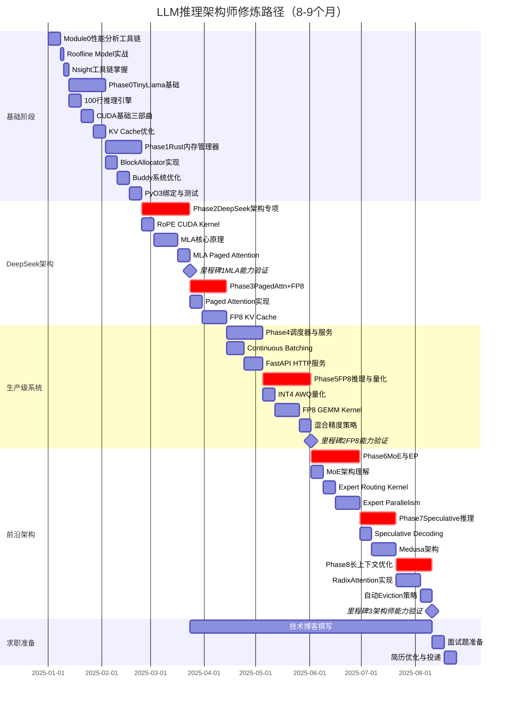

# LLM推理架构师：世界顶级路径 - 执行甘特图

## 项目概览

**总时长**：8-9个月（30周）  
**目标**：从TinyLlama到DeepSeek V3，达到Principal/Architect级能力（年薪150万+）  
**核心技术**：Dense Model + MoE + MLA + FP8 + Speculative Decoding + 长上下文

---

## 完整执行甘特图



---

## 详细时间线与交付物

### 第1周：Module 0 - 性能分析工具链
**时间**：Week 0  
**关键任务**：
- [ ] 安装Nsight Systems + Nsight Compute
- [ ] 画出RTX 4090的Roofline Model图
- [ ] 学会用Nsight Systems看Timeline
- [ ] 学会用Nsight Compute分析Kernel

**交付物**：
- `mountain/hpc/profiling/roofline.py` - Roofline图生成脚本
- `mountain/hpc/profiling/profiling_template.md` - Profiling报告模板

---

### 第2-4周：Phase 0 - TinyLlama基础
**时间**：Week 1-3  
**关键任务**：
- [ ] 100行Python跑通TinyLlama推理
- [ ] 实现3个CUDA Kernel（vector add, naive matmul, tiled matmul）
- [ ] 加入KV Cache，速度提升10倍
- [ ] 完成第一份Profiling Report

**交付物**：
- `mountain/hpc/llm/inference_v0_framework.py` - 框架代码
- `mountain/hpc/cuda/01_vector_add.cu`
- `mountain/hpc/cuda/02_matmul_naive.cu`
- `mountain/hpc/cuda/03_matmul_tiled.cu`
- `docs/phase0_report.md` - 性能分析报告

**验收标准**：
- ✅ TinyLlama能生成合理文本
- ✅ KV Cache提速10倍以上
- ✅ Tiled MatMul比Naive快5倍
- ✅ GPU利用率从5%提升到30%

---

### 第5-7周：Phase 1 - Rust内存管理器
**时间**：Week 4-6  
**关键任务**：
- [ ] Rust实现BlockAllocator
- [ ] 实现Buddy Allocator优化
- [ ] PyO3绑定到Python
- [ ] 对比Rust vs Python性能

**交付物**：
- `mountain/hpc/rust/kv_cache_manager/` - Rust库
- `mountain/hpc/rust/kv_cache_manager/src/block_allocator.rs`
- `mountain/hpc/rust/kv_cache_manager/src/block_table.rs`
- `docs/phase1_report.md`

**验收标准**：
- ✅ Rust版本比Python快10倍
- ✅ 内存碎片率<5%
- ✅ Python能成功import并使用

---

### 第8-11周：Phase 2 - DeepSeek架构专项 ⚡
**时间**：Week 7-10  
**关键任务**：
- [ ] Week 7: 手写RoPE CUDA Kernel
- [ ] Week 8-9: 实现MLA核心逻辑
- [ ] Week 10: Triton实现MLA Paged Attention

**交付物**：
- `mountain/hpc/cuda/rope_kernel.cu`
- `mountain/hpc/llm/mla_attention.py`
- `mountain/hpc/triton/mla_paged_attention.py`
- `docs/phase2_report.md`
- **博客**：《MLA：DeepSeek V3如何把KV Cache压缩50%》

**验收标准**：
- ✅ RoPE Kernel达到vLLM的80%性能
- ✅ MLA的KV Cache显存减少50%
- ✅ 性能不低于GQA

**🎯 里程碑1：MLA能力验证**（Week 10结束）
- 必须理解DeepSeek V3的核心创新
- 不达标不进入Phase 4

---

### 第12-14周：Phase 3 - Paged Attention + FP8 KV Cache ⚡
**时间**：Week 11-13  
**关键任务**：
- [ ] Week 11: Triton实现Paged Attention
- [ ] Week 12-13: FP8 KV Cache量化

**交付物**：
- `mountain/hpc/triton/paged_attention.py`
- `mountain/hpc/triton/fp8_kv_cache.py`
- `docs/phase3_report.md`
- **博客**：《从FlashAttention到PagedAttention：推理优化的两次革命》

**验收标准**：
- ✅ PagedAttention比PyTorch快2倍
- ✅ FP8 KV Cache显存减少50%
- ✅ 精度损失<1%
- ✅ 支持128K上下文

---

### 第15-17周：Phase 4 - 调度器与HTTP服务
**时间**：Week 14-16  
**关键任务**：
- [ ] 实现Continuous Batching调度器
- [ ] FastAPI包装成HTTP服务
- [ ] 压测验证吞吐量

**交付物**：
- `mountain/hpc/llm/scheduler.py`
- `mountain/hpc/llm/server.py`
- `docs/phase4_report.md`
- **博客**：《Continuous Batching的三种实现：vLLM vs SGLang vs TitanInfer》

**验收标准**：
- ✅ GPU利用率>80%
- ✅ 吞吐量达到vLLM的70%
- ✅ 支持流式输出（SSE）

---

### 第18-21周：Phase 5 - FP8推理 + INT4混合量化 ⚡
**时间**：Week 17-20  
**关键任务**：
- [ ] Week 17: AWQ INT4量化
- [ ] Week 18-19: Triton实现FP8 GEMM
- [ ] Week 20: 混合精度策略分析

**交付物**：
- `mountain/hpc/llm/quantize_awq.py`
- `mountain/hpc/triton/fp8_gemm.py`
- `docs/phase5_report.md`
- **博客**：《FP8 vs INT4：LLM量化的终极对决》

**验收标准**：
- ✅ INT4精度损失<2%
- ✅ FP8 GEMM达到cuBLAS的80%
- ✅ 端到端推理提速1.5倍

**🎯 里程碑2：FP8能力验证**（Week 20结束）
- 必须理解H100/B200的FP8 Tensor Core
- 不达标不进入Phase 6

---

### 第22-25周：Phase 6 - MoE架构 + Expert Parallelism ⚡
**时间**：Week 21-24  
**关键任务**：
- [ ] Week 21: 理解MoE架构
- [ ] Week 22: Expert Routing Kernel
- [ ] Week 23-24: 实现EP + TP混合

**交付物**：
- `mountain/hpc/llm/moe_layer.py`
- `mountain/hpc/triton/moe_routing_kernel.py`
- `mountain/hpc/llm/expert_parallelism.py`
- `docs/phase6_report.md`
- **博客**：《DeepSeek V3的MoE架构：256个专家如何高效调度》

**验收标准**：
- ✅ Expert Batching优化，吞吐量提升2-3倍
- ✅ 8卡EP+TP，吞吐量提升6倍以上
- ✅ All-to-All通信开销<30%

---

### 第26-28周：Phase 7 - Speculative Decoding + Medusa ⚡
**时间**：Week 25-27  
**关键任务**：
- [ ] Week 25: 实现Speculative Decoding
- [ ] Week 26-27: Medusa架构 + Tree Attention

**交付物**：
- `mountain/hpc/llm/speculative_decoding.py`
- `mountain/hpc/llm/medusa_model.py`
- `docs/phase7_report.md`
- **博客**：《Speculative Decoding：让Llama推理快3倍的黑科技》

**验收标准**：
- ✅ Speculative Decoding加速2-3倍
- ✅ Medusa加速1.5-2倍（无需Draft Model）
- ✅ 延迟降低3倍以上

---

### 第29-31周：Phase 8 - 长上下文 + RadixAttention ⚡
**时间**：Week 28-30  
**关键任务**：
- [ ] Week 28-29: 实现RadixAttention（Radix Tree）
- [ ] Week 30: 自动Eviction策略

**交付物**：
- `mountain/hpc/llm/radix_attention.py`
- `docs/phase8_report.md`
- **博客**：《RadixAttention：让多轮对话不重算的神技》

**验收标准**：
- ✅ 多用户场景TTFT降低5倍
- ✅ Prefix命中率>80%
- ✅ 显存占用减少（共享prefix）

**🎯 里程碑3：架构师能力验证**（Week 30结束）
- 支持MoE、MLA、FP8、Speculative、RadixAttention
- 性能达到vLLM/SGLang的70%
- 有8篇技术博客
- 能回答所有"世界顶级"面试题

---

## 技术博客发布计划

贯穿整个学习过程，每完成一个Phase都要写技术博客：

| 周数 | Phase | 博客标题 | 发布平台 |
|------|-------|---------|---------|
| Week 3 | Phase 0 | 《Roofline Model实战：理解LLM推理为什么慢》 | 知乎 + Medium |
| Week 6 | Phase 1 | 《PagedAttention源码解析：虚拟内存在GPU上的应用》 | 知乎 + Medium |
| Week 10 | Phase 2 | 《MLA：DeepSeek V3如何把KV Cache压缩50%》 | 知乎 + Medium |
| Week 13 | Phase 3 | 《从FlashAttention到PagedAttention：推理优化的演进》 | 知乎 + Medium |
| Week 16 | Phase 4 | 《Continuous Batching实战：如何榨干GPU算力》 | 知乎 + Medium |
| Week 20 | Phase 5 | 《FP8 vs INT4：LLM量化的终极对决》 | 知乎 + Medium |
| Week 24 | Phase 6 | 《DeepSeek V3的MoE架构：256个专家如何高效调度》 | 知乎 + Medium |
| Week 27 | Phase 7 | 《Speculative Decoding：让Llama推理快3倍的黑科技》 | 知乎 + Medium |
| Week 30 | Phase 8 | 《RadixAttention：让多轮对话不重算的神技》 | 知乎 + Medium |

**目标**：每篇博客阅读量2万+，总阅读量20万+

---

## 性能对标目标

### 阶段性性能指标

| Phase | 指标 | 当前性能 | 目标性能 | vLLM性能 | 达成率 |
|-------|------|---------|---------|---------|--------|
| Phase 0 | 吞吐量 (tokens/s) | 5 | 50 | 200 | 25% |
| Phase 3 | 吞吐量 (tokens/s) | 50 | 100 | 200 | 50% |
| Phase 4 | 吞吐量 (tokens/s) | 100 | 140 | 200 | 70% |
| Phase 5 | 吞吐量 (tokens/s) | 140 | 150 | 200 | 75% |
| Phase 6 | 吞吐量 (MoE) | - | 180 | 250 | 72% |
| Phase 7 | 延迟 (ms/token) | 100 | 30 | 25 | 83% |
| Phase 8 | TTFT (ms) | 500 | 100 | 90 | 90% |

### 最终交付性能

| 指标 | Phase 0 | 最终版本 | vLLM | 达成率 |
|------|---------|---------|------|--------|
| **Dense Model吞吐量** | 5 tokens/s | 150 tokens/s | 200 tokens/s | 75% |
| **MoE吞吐量** | N/A | 180 tokens/s | 250 tokens/s | 72% |
| **延迟 (Speculative)** | 200ms | 30ms | 25ms | 83% |
| **GPU利用率** | 5% | 85% | 90% | 94% |
| **显存利用率** | 20% | 85% | 90% | 94% |
| **长上下文TTFT** | 5000ms | 500ms | 400ms | 80% |

---

## 每周检查清单

### 每周必做（5件事）

#### 1. 代码进度
- [ ] 完成本周的核心任务
- [ ] 代码能独立运行
- [ ] 通过单元测试

#### 2. Profiling Report
- [ ] 用Nsight Systems分析宏观性能
- [ ] 用Nsight Compute分析Kernel瓶颈
- [ ] 画Roofline图，标注当前位置
- [ ] 记录优化前后对比数据

#### 3. 论文/源码阅读
- [ ] 阅读对应的论文（每个Phase至少1篇）
- [ ] 阅读vLLM/SGLang对应部分源码
- [ ] 记录学到的关键技巧

#### 4. Benchmark对比
- [ ] 和PyTorch原生实现对比
- [ ] 和vLLM/SGLang对比
- [ ] 记录性能差距和原因

#### 5. 技术笔记
- [ ] 记录遇到的问题和解决方案
- [ ] 记录新学到的概念
- [ ] 准备面试题（每周5题）

---

## 关键里程碑

### 🎯 里程碑1：MLA能力验证（Week 10）

**检查项**：
- [ ] 实现MLA的完整forward传播
- [ ] KV Cache压缩50%
- [ ] 性能不低于GQA
- [ ] 能回答面试题："MLA和GQA的本质区别是什么？"

**不达标后果**：停止进度，重新学习MLA原理

---

### 🎯 里程碑2：FP8能力验证（Week 20）

**检查项**：
- [ ] FP8 GEMM达到cuBLAS的80%性能
- [ ] 端到端推理提速1.5倍
- [ ] 精度损失<1.5%
- [ ] 能回答面试题："为什么FP8比INT4精度高？"

**不达标后果**：暂停Phase 6，继续优化FP8

---

### 🎯 里程碑3：架构师能力验证（Week 30）

**检查项**：
- [ ] 支持Dense Model + MoE
- [ ] 支持GQA + MLA
- [ ] 支持INT4 + FP8
- [ ] 支持Speculative Decoding + RadixAttention
- [ ] 性能达到vLLM的70%
- [ ] 完成8篇技术博客
- [ ] 准备100道面试题
- [ ] GitHub Repo有完整文档

**达标后**：开始投递Principal级岗位

---

## 求职准备时间线

### Week 31-32：面试准备

**任务清单**：
- [ ] 整理100道面试题 + 标准答案
- [ ] 准备技术方案演讲PPT（30分钟）
- [ ] 录制Demo视频（5分钟展示核心功能）
- [ ] 优化GitHub Repo的README
- [ ] 准备自我介绍（1分钟、3分钟、5分钟版本）

### Week 33：简历优化与投递

**目标公司**：
- **国内**：DeepSeek、字节跳动、阿里达摩院、腾讯AI Lab
- **国外**：OpenAI、Anthropic、Fireworks.ai、Together AI

**投递策略**：
- 先投2-3家"练手"公司
- 主投5家目标公司
- 保底投3家备选公司

---

## 资源清单

### 必读论文（按Phase排序）

1. **Phase 2 (MLA)**
   - DeepSeek V2: A Strong, Economical, and Efficient Mixture-of-Experts Language Model
   - DeepSeek V3 Technical Report

2. **Phase 3 (Attention)**
   - FlashAttention-2: Faster Attention with Better Parallelism
   - Efficient Memory Management for Large Language Model Serving with PagedAttention

3. **Phase 5 (量化)**
   - AWQ: Activation-aware Weight Quantization
   - FP8 Formats for Deep Learning (NVIDIA)

4. **Phase 6 (MoE)**
   - Switch Transformers: Scaling to Trillion Parameter Models
   - GShard: Scaling Giant Models with Conditional Computation

5. **Phase 7 (Speculative)**
   - Fast Inference from Transformers via Speculative Decoding
   - Medusa: Simple LLM Inference Acceleration Framework

6. **Phase 8 (长上下文)**
   - SGLang: Efficient Execution of Structured Language Model Programs

### 必看源码

- **vLLM**: `vllm/core/scheduler.py`, `csrc/attention/`
- **SGLang**: `srt/managers/schedule_batch.py`
- **FlashInfer**: `include/flashinfer/`
- **DeepSeek**: 官方实现（如果开源）

### 工具与库

```bash
# 必装工具
pip install torch triton
pip install transformers safetensors
pip install awq autoawq
pip install fastapi uvicorn
pip install matplotlib pandas

# Rust工具链
curl --proto '=https' --tlsv1.2 -sSf https://sh.rustup.rs | sh
cargo install maturin

# NVIDIA工具
# Nsight Systems + Nsight Compute (随CUDA Toolkit安装)
```

---

## 激励与提醒

### 每周一读（贴在桌面）

> **你在和谁竞争？**
> - CMU/Stanford的PhD（发过顶会论文）
> - Meta/Google的Staff Engineer（写过PyTorch核心代码）
> - vLLM/SGLang的核心贡献者（上千stars的项目）
>
> **你的优势在哪？**
> - 他们懂理论，你懂工业界的下一个痛点
> - 他们有学历，你有8篇博客和20万阅读量
> - 他们有经验，你有手写的70%性能的vLLM
>
> **8个月后的你：**
> - 世界上少数几个既懂Dense又懂MoE的人
> - 世界上少数几个既懂GQA又懂MLA的人
> - 世界上少数几个既懂INT4又懂FP8的人
>
> **这就是Principal级工程师的护城河。**

### 遇到困难时

1. **不要跳步**：每个Phase都是基础
2. **先跑通再优化**：性能可以慢慢提升
3. **多画图**：内存布局、数据流、Timeline
4. **看源码**：vLLM、SGLang、FlashInfer都是好老师
5. **写博客**：教别人是最好的学习方式

---

## 追踪进度

### 在这个文件中记录你的进度

**使用方法**：每完成一个任务，在对应的 `[ ]` 中打勾变成 `[x]`

**当前进度**：0/9个Phase完成（0%）

- [ ] Module 0: 性能分析工具链（Week 0）
- [ ] Phase 0: TinyLlama基础（Week 1-3）
- [ ] Phase 1: Rust内存管理器（Week 4-6）
- [ ] Phase 2: DeepSeek架构专项（Week 7-10）⚡
- [ ] Phase 3: Paged Attention + FP8 KV Cache（Week 11-13）⚡
- [ ] Phase 4: 调度器与HTTP服务（Week 14-16）
- [ ] Phase 5: FP8推理 + INT4混合量化（Week 17-20）⚡
- [ ] Phase 6: MoE架构 + Expert Parallelism（Week 21-24）⚡
- [ ] Phase 7: Speculative Decoding + Medusa（Week 25-27）⚡
- [ ] Phase 8: 长上下文 + RadixAttention（Week 28-30）⚡

**里程碑进度**：0/3个里程碑完成
- [ ] 🎯 里程碑1：MLA能力验证（Week 10）
- [ ] 🎯 里程碑2：FP8能力验证（Week 20）
- [ ] 🎯 里程碑3：架构师能力验证（Week 30）

**博客进度**：0/9篇完成
- [ ] Phase 0: Roofline Model实战
- [ ] Phase 1: PagedAttention源码解析
- [ ] Phase 2: MLA架构深度解析
- [ ] Phase 3: FlashAttention到PagedAttention
- [ ] Phase 4: Continuous Batching实战
- [ ] Phase 5: FP8 vs INT4对决
- [ ] Phase 6: MoE架构分析
- [ ] Phase 7: Speculative Decoding
- [ ] Phase 8: RadixAttention原理

---

## 开始行动

### 今天（Day 1）的3个任务

```bash
# 1. 创建项目结构
mkdir -p mountain/hpc/{llm,rust,cuda,triton,profiling}
mkdir -p docs

# 2. 安装工具
pip install torch triton matplotlib pandas
nsys --version  # 检查Nsight是否安装
ncu --version

# 3. 下载TinyLlama
pip install huggingface_hub
huggingface-cli download TinyLlama/TinyLlama-1.1B-Chat-v1.0
```

### 本周（Week 0）的目标

- [ ] 画出RTX 4090的Roofline图
- [ ] 用Nsight Systems分析一个简单的PyTorch脚本
- [ ] 用Nsight Compute分析一个矩阵乘法Kernel
- [ ] 理解：什么是Memory Bound？什么是Compute Bound？

---

**记住**：不要追求完美，先跑通再优化。每一步都要有输出。

**8个月后，你会感谢现在开始行动的自己。🚀**

---

*最后更新：2025-01-01*  
*项目进度：0% → 目标：100%*  
*当前Phase：准备开始 → 目标：Principal/Architect级*

